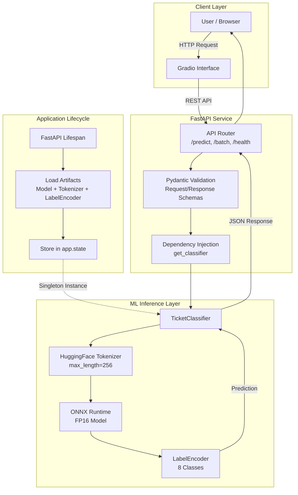

# IT Support Ticket Triage API

FastAPI backend serving a fine-tuned ModernBERT model for classifying IT support tickets. The model runs via ONNX Runtime, so PyTorch is not needed at serving time - keeps the container small. Covers the full pipeline: data exploration, training, FP16 quantization, and deployment.

## Tech Stack

Python 3.10+ with `uv` package manager

**Machine Learning**

PyTorch, HuggingFace Transformers, ONNX Runtime, ModernBERT, scikit-learn, MLflow, DagsHub

**Backend**

FastAPI, Pydantic, Uvicorn, ONNX Runtime, Docker

**Frontend**

Gradio

## Features

- Fine-tuned ModernBERT on 50k IT tickets
- 8-class classification: Access, Administrative Rights, HR Support, Hardware, Internal Project, Miscellaneous, Purchase, Storage
- FP16 quantization (2x memory reduction, no accuracy loss)
- Stratified splits and class weights to handle 7:1 class imbalance
- REST API with validation, logging, and health checks
- Batch inference (up to 100 tickets per request)
- Gradio frontend with single and batch prediction tabs
- MLflow + DagsHub experiment tracking
- Docker deployment with non-root user

## Description

### The model

`answerdotai/ModernBERT-base` (139M parameters), fine-tuned for 3 epochs with class-weighted CrossEntropyLoss on the IT ticket dataset. Exported to ONNX FP16 for serving.

Three artifacts are loaded at startup:

- `tokenizer/` - HuggingFace `AutoTokenizer`, converts raw ticket text to token IDs
- `model.onnx` - FP16 ONNX model, runs on CPU via `onnxruntime`
- `label_encoder.joblib` - scikit-learn `LabelEncoder`, maps integer predictions back to class names

Model config:

- `max_length=256` - covers 95%+ of tickets without truncation (95th percentile is 151 tokens)
- INT8 was tried and abandoned; LayerNorm layers are sensitive to quantization and predictions collapsed to a fixed class. FP16 gave 2x memory reduction with no accuracy drop, so that's what ships.

### The API

All three artifacts are loaded once at startup via FastAPI's lifespan context manager and stored in `app.state`. Routes get the classifier via `Depends()` - no global variables.

APIs are versioned with `APIRouter`:

**Endpoints:**

| Method | Path | Description |
|--------|------|-------------|
| `GET` | `/` | API info |
| `GET` | `/health` | Load status of each model artifact |
| `POST` | `/api/v1/predict` | Classify a single ticket, returns `predicted_class`, `confidence`, optional `all_scores` |
| `POST` | `/api/v1/predict/batch` | Classify up to 100 tickets, returns a prediction for each |

CORS origins, artifact path, log level, and port are all configurable via `.env`.
OpenAPI docs available at `/docs`.

### The frontend

Gradio app with two tabs. Single prediction shows a bar chart of confidence scores across all 8 classes. Batch prediction takes one ticket per line and returns a results table. The backend URL is set via `API_BASE_URL`, so the same frontend works locally, in Docker, or on HF Spaces.

### Notebook

Training and EDA notebook on Kaggle: [ticket-triage](https://www.kaggle.com/code/kirtang/ticket-triage)

## Project structure

```
ticket_triage/
├── app/
│   ├── main.py                 # FastAPI entry point, lifespan wiring
│   ├── api/
│   │   ├── routes.py           # v1 endpoints (predict, predict/batch)
│   │   └── schemas.py          # Pydantic request/response models
│   ├── ml/
│   │   └── model.py            # TicketClassifier: tokenize, run ONNX, decode
│   ├── utils/
│   │   ├── config.py           # pydantic-settings, loads .env
│   │   ├── lifespan.py         # startup/shutdown handler
│   │   └── logging.py          # logging config
│   └── artifacts/              # not tracked in git
│       ├── tokenizer/
│       ├── model/
│       │   └── model.onnx
│       └── encoder/
│           └── label_encoder.joblib
├── frontend/
│   └── gradio_frontend.py
├── Dockerfile.backend
├── Dockerfile.frontend
├── docker-compose.yml
├── .dockerignore
├── pyproject.toml
└── uv.lock
```

## Usage

### Prerequisites

Model artifacts are not in the repository. You need:

```
app/artifacts/
├── tokenizer/          # config.json, tokenizer.json, etc.
├── model/
│   └── model.onnx
└── encoder/
    └── label_encoder.joblib
```

I'll upload artifacts to HF Spaces when the live demo is ready.

Install dependencies:

```bash
uv sync
```

### Configuration

```bash
cp .env.example .env
```

| Variable | Default | Description |
|---|---|---|
| `API_HOST` | `0.0.0.0` | Host for Uvicorn |
| `API_PORT` | `8080` | Backend port |
| `LOG_LEVEL` | `INFO` | Log level |
| `CORS_ORIGINS` | `["http://localhost"]` | Allowed origins |
| `ARTIFACTS_DIR` | `<app_dir>/artifacts` | Path to model artifacts |
| `API_BASE_URL` | `http://localhost:8080/api/v1` | Backend URL for Gradio |

---

### Running locally

```bash
# Terminal 1 - backend
cd app
python main.py

# Terminal 2 - frontend
cd frontend
python gradio_frontend.py
```

Backend at `http://localhost:8080`, Gradio at `http://localhost:7860`.

---

### Running with Docker

The compose file uses bind mounts - `app/artifacts` is mounted from your host, so images stay small and you don't need to rebuild when swapping model files.

```bash
# Start both services
docker compose up --build

# Stop
docker compose down

# Stop and remove images
docker compose down --rmi all
```

---

## Architecture



## Lessons learned

### Modelling

**Token length analysis matters before picking `max_length`.** I ran percentiles across the full dataset (50th: 31 tokens, 95th: 151, 99th: 305) before settling on 256. Picking 512 by default would have doubled padding and slowed inference for no real gain - only 1% of tickets actually need more than 305 tokens.

**Stratified splits are not optional when classes are imbalanced.** A random split on a 7:1 imbalance can leave minority classes with under 100 validation samples. At that point your F1 scores are noise, not signal. Always pass `stratify=`.

**Class weights belong on training data only.** Computing them on the full dataset before splitting leaks distributional information into training. It's a small effect with stratified splits, but it's still wrong and it will come up in a code review.

**LabelEncoder is a model artifact, not a convenience.** Hardcoding the class-to-index mapping means a retrain with different data silently breaks inference. Version the encoder with the model and tokenizer, load them together, treat them as a unit.

**INT8 quantization is fragile on transformer encoders.** Both static and dynamic INT8 resulted in the model predicting the same class regardless of input - the classic sign of miscalibrated quantization ranges. LayerNorm layers are the main culprit. FP16 was the right call: same accuracy as FP32, half the memory, none of the debugging pain.

**Overall accuracy is the wrong metric for imbalanced classification.** Hardware has 13.5k samples; Administrative Rights has 1.8k. A model that ignores the minority classes can still hit 85% accuracy. Macro F1 and per-class scores are what actually tell you if the model learned anything useful.

### Engineering

**Global variables are the wrong way to hold model state in FastAPI.** `app.state` with `Depends()` is cleaner, survives test isolation, and is what the framework actually recommends. The first version used a global; it got refactored out early.

**Load models at startup, not on first request.** If the ONNX file is missing or corrupted, you want to know at boot time, not when the first user hits `/predict`. Lifespan context managers exist for exactly this.

**A batch endpoint is worth building.** Vectorized tokenization across 32 tickets in one ONNX call is meaningfully faster than 32 individual calls. If you're doing any volume at all, it matters.

**Structured logging earns its keep post-deployment.** Per-request logs with predicted class, confidence, and latency take maybe 10 minutes to add. Without them, debugging a live model is mostly guesswork.

**Separating routes, schemas, ML logic, and config pays off fast.** The project is small enough that everything could live in one file. It doesn't, because even at this scale mixing concerns makes changes harder than they should be.

### Deployment

**MLflow + DagsHub made the INT8 debugging tractable.** Every run had its hyperparameters and per-class metrics logged. Comparing the FP32, FP16, and INT8 runs side by side was straightforward; without tracking, I'd have been re-running experiments from memory.

**Non-root containers are not optional.** Running as root inside Docker is a bad habit and a real security risk. Adding a non-root user to the Dockerfile takes two lines.

**Health endpoints matter more than they seem.** Without `/health`, an orchestrator has no way to know whether the model actually loaded. Traffic routes to broken pods. The endpoint is five lines of code.

**CORS will catch you if you forget it.** Gradio on port 7860 calling FastAPI on port 8080 fails silently in the browser if CORS isn't configured. Worth setting up before you start testing the frontend.

## Acknowledgements

- [ModernBERT](https://huggingface.co/answerdotai/ModernBERT-base) by Answer.AI
- [Optimum](https://github.com/huggingface/optimum) for ONNX export
- [HuggingFace Transformers](https://huggingface.co/docs/transformers/)
- [ONNX Runtime](https://onnxruntime.ai/)
- [IT Service Ticket Classification Dataset](https://www.kaggle.com/datasets/adisongoh/it-service-ticket-classification-dataset) on Kaggle
- Various YouTube videos and blog posts on fine-tuning BERT - too many to name, but they helped.