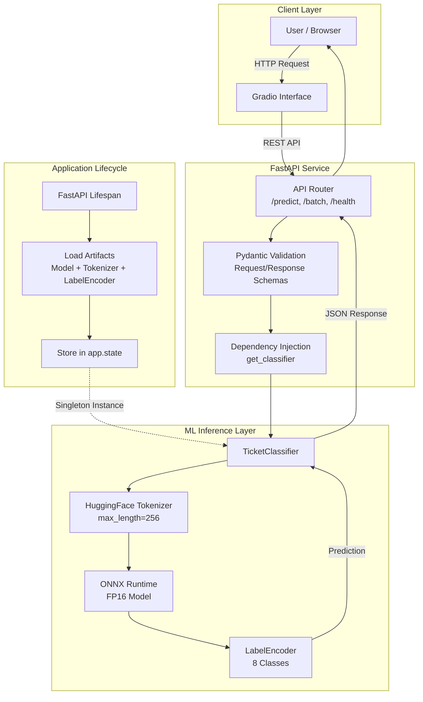

# IT Ticket Classification System

An IT support ticket classifier built with fine-tuned ModernBERT and FastAPI. Covers data analysis, model training, FP16 quantization, and REST API deployment.

## Tech Stack

Python 3.10+ with `uv` package manager

**Machine Learning**

PyTorch, HuggingFace Transformers, ONNX Runtime, ModernBERT, scikit-learn, MLflow, DagsHub

**Backend**

FastAPI, Pydantic, Uvicorn, ONNX Runtime, Docker

**Frontend**

Gradio

## Features

- Fine-tuned ModernBERT (Dec 2024 release) on 50k IT tickets
- 8-class classification: Access, Administrative Rights, HR Support, Hardware, Internal Project, Miscellaneous, Purchase, Storage
- FP16 quantization (2x memory reduction, no accuracy loss)
- Class imbalance handling via stratified splits and class weights (7:1 ratio)
- REST API with error handling, logging, health checks
- Batch inference (up to 100 tickets per request)
- Gradio web interface
- MLflow + DagsHub experiment tracking
- Docker deployment with non-root user
- Per-class F1 scores and inference latency tracking

## Description

### About the Dataset

The dataset is sourced from [Kaggle: IT Service Ticket Classification Dataset](https://www.kaggle.com/datasets/adisongoh/it-service-ticket-classification-dataset) containing approximately 50,000 real-world IT support tickets across 8 categories.

**Class Distribution Analysis:**

The dataset exhibits moderate class imbalance:

- **Majority classes**: Hardware (~13.5k), HR Support (~11k)
- **Moderate classes**: Access (~7k), Miscellaneous (~7k)
- **Minority classes**: Administrative Rights (~1.8k), Internal Project (~2.2k), Purchase (~2.5k), Storage (~2.8k)

**Imbalance ratio**: ~7:1 (largest to smallest class)

**Preprocessing Strategy:**

1. **Stratified train/val/test splits** to preserve class distribution across all sets
2. **Class weight calculation** on training data only to avoid data leakage
3. **Token length analysis**: 95th percentile = 151 tokens → selected `max_length=256` for optimal coverage vs. speed tradeoff

### About the ModernBERT Model

[ModernBERT](https://huggingface.co/answerdotai/ModernBERT-base) (Answer.AI, December 2024) is a modern encoder-only transformer with several advantages over older BERT variants:

**Why ModernBERT over RoBERTa/DeBERTa:**

- **Recency**: Trained on 2 trillion tokens of recent data (post-2024), capturing modern IT terminology
- **Architectural improvements**: FlashAttention, rotary positional embeddings, better efficiency
- **Extended context**: 8192 token capability (vs. 512 for RoBERTa/DeBERTa)
- **Production optimizations**: Better inference speed at equivalent model size

**Model Configuration:**

- Base model: `answerdotai/ModernBERT-base` (139M parameters)
- Fine-tuning: 3 epochs with class-weighted CrossEntropyLoss
- Quantization: FP32 → FP16 via ONNX (INT8 showed degradation due to LayerNorm sensitivity)
- Input: `max_length=256`, covers 95%+ of ticket lengths without truncation
- Output: 8-class softmax classification

**Performance Metrics:**

- **Macro F1**: 0.87 (across all classes)
- **Inference latency**: ~220ms (FP16 ONNX on CPU)
- **Batch throughput**: ~450ms for 32 tickets
- **Model size**: 450MB (FP16), down from 900MB (FP32)

**Quantization Investigation:**

Extensive testing of quantization approaches:

- **FP32 baseline**: Original fine-tuned model
- **FP16 ONNX**: ✅ Zero accuracy loss, 2x memory reduction, 1.3x speedup
- **INT8 static**: ❌ Degraded to fixed-class predictions (calibration issues)
- **INT8 dynamic**: ❌ LayerNorm sensitivity caused accuracy collapse

**Decision**: Shipped FP16 as production artifact. INT8 investigation documented as a learning artifact demonstrating debugging methodology for quantization failures.

### About the FastAPI Application

The backend is a production-grade REST API with proper separation of concerns and dependency injection.

**Architecture Principles:**

- **No global variables**: Model loaded once in FastAPI lifespan, stored in `app.state`
- **Dependency injection**: `Depends()` pattern for clean, testable code
- **Modular structure**: Separate modules for routing, schemas, ML logic, configuration
- **Comprehensive logging**: Structured logs for debugging and observability
- **Health monitoring**: `/health` endpoint with model status and uptime

**Available Endpoints:**

1. **`GET /`**  
   API information and documentation links

2. **`GET /health`**  
   Health check with model load status, version, and uptime

3. **`GET /classes`**  
   Returns list of all available ticket categories

4. **`POST /predict`**  
   Single ticket classification with confidence scores  
   Request: `{"text": "laptop broken", "return_all_scores": true}`  
   Response: `{"predicted_class": "Hardware", "confidence": 0.94, "all_scores": {...}, "inference_time_ms": 220}`

5. **`POST /predict/batch`**  
   Batch inference for up to 100 tickets  
   More efficient than multiple single requests  
   Returns per-ticket predictions with average latency

**Technical Details:**

- **Model artifacts**: ONNX model, HuggingFace tokenizer, scikit-learn LabelEncoder loaded together
- **CORS support**: Configured for frontend integration
- **Request validation**: Pydantic schemas with field validators
- **Error handling**: Graceful degradation with informative error messages
- **Middleware**: Request logging with latency tracking
- **OpenAPI docs**: Auto-generated at `/docs` for API exploration

### About the Frontend

Built with **Gradio** for rapid prototyping and user-friendly interaction.

**Features:**

- Single ticket text input with multi-line support
- Real-time classification with probability distribution
- Example tickets for quick testing
- Connects to FastAPI backend via REST API
- Displays prediction metadata (confidence, latency, model version)

**Deployment Options:**

1. **Local**: Run alongside FastAPI backend
2. **HuggingFace Spaces**: Free public deployment with permanent shareable link
3. **Docker Compose**: Containerized frontend + backend stack

## Project Structure

```
ticket-classification/
├── backend/
│   ├── app/
│   │   ├── __init__.py
│   │   ├── main.py              # FastAPI app with lifespan management
│   │   ├── dependencies.py      # Dependency injection functions
│   │   ├── api/
│   │   │   ├── __init__.py
│   │   │   ├── routes.py        # API endpoints (predict, batch, health)
│   │   │   └── schemas.py       # Pydantic request/response models
│   │   ├── core/
│   │   │   ├── __init__.py
│   │   │   ├── config.py        # Configuration with pydantic-settings
│   │   │   └── logging.py       # Logging setup
│   │   ├── ml/
│   │   │   ├── __init__.py
│   │   │   └── model.py         # TicketClassifier class (ONNX inference)
│   │   └── utils/
│   │       └── __init__.py
│   ├── models/                  # Model artifacts (not in git)
│   │   ├── model_fp16.onnx
│   │   ├── label_encoder.joblib
│   │   └── tokenizer/
│   ├── tests/
│   │   ├── __init__.py
│   │   ├── test_api.py
│   │   └── test_model.py
│   ├── Dockerfile
│   ├── requirements.txt
│   └── .dockerignore
├── frontend/
│   ├── app.py                   # Gradio interface
│   ├── Dockerfile
│   └── requirements.txt
├── notebooks/
│   ├── 01_eda.ipynb            # Exploratory data analysis
│   ├── 02_training.ipynb       # Model fine-tuning with MLflow
│   └── 03_quantization.ipynb   # FP16/INT8 experiments
├── docker-compose.yml
├── .env.example
├── .gitignore
└── README.md
```

## Usage

### Prerequisites

1. **Download model artifacts** (not included in repository):
   - Fine-tuned ModernBERT (FP16 ONNX): `model_fp16.onnx`
   - Tokenizer files: HuggingFace tokenizer directory
   - Label encoder: `label_encoder.joblib`

   Place these in `backend/models/`

2. **Install dependencies**:
   ```bash
   # Using uv (recommended)
   cd backend
   uv pip install -r requirements.txt
   ```

### Running Locally

**Backend only:**
```bash
cd backend
python -m app.main

# API will be available at http://localhost:8000
# OpenAPI docs at http://localhost:8000/docs
```

**Frontend only:**
```bash
cd frontend
python app.py

# Gradio UI at http://localhost:7860
```

### Running with Docker Compose

```bash
# Build and start both services
docker-compose up --build

# Access points:
# - API: http://localhost:8000
# - Gradio: http://localhost:7860
# - Health check: http://localhost:8000/health
```

**Individual service:**
```bash
# Backend only
docker-compose up api

# Frontend only
docker-compose up gradio
```

### Testing the API

**Single prediction:**
```bash
curl -X POST http://localhost:8000/predict \
  -H "Content-Type: application/json" \
  -d '{
    "text": "My laptop screen is broken and won'\''t turn on",
    "return_all_scores": true
  }'
```

**Batch prediction:**
```bash
curl -X POST http://localhost:8000/predict/batch \
  -H "Content-Type: application/json" \
  -d '{
    "tickets": [
      "Need access to finance shared drive",
      "Laptop screen flickering",
      "Forgot HR portal password"
    ]
  }'
```

**Health check:**
```bash
curl http://localhost:8000/health
```

## Training Pipeline

### 1. Data Exploration

```python
# Token length distribution analysis
from transformers import AutoTokenizer

tokenizer = AutoTokenizer.from_pretrained("answerdotai/ModernBERT-base")
lengths = [len(tokenizer.encode(text)) for text in dataset['Document']]

# Percentiles: [31, 99, 151, 305] → chose max_length=256
```

### 2. Stratified Splitting

```python
from sklearn.model_selection import train_test_split

# First split: train vs (val+test)
X_train, X_val_test, y_train, y_val_test = train_test_split(
    dataset['Document'], 
    dataset['topic_encoded'],
    train_size=40_000,
    random_state=42,
    stratify=dataset['topic_encoded']  # Critical for imbalance
)

# Second split: val vs test
X_val, X_test, y_val, y_test = train_test_split(
    X_val_test, 
    y_val_test,
    test_size=0.5,
    random_state=42,
    stratify=y_val_test
)
```

### 3. Class Weight Calculation

```python
from sklearn.utils.class_weight import compute_class_weight

# Computed on training data only (no leakage)
class_weights = compute_class_weight(
    class_weight='balanced',
    classes=np.unique(y_train),
    y=y_train
)
```

### 4. Fine-tuning with HuggingFace Trainer

```python
from transformers import Trainer, TrainingArguments

training_args = TrainingArguments(
    output_dir="./results",
    num_train_epochs=3,
    per_device_train_batch_size=32,
    learning_rate=2e-5,
    evaluation_strategy="epoch",
    save_strategy="epoch",
    load_best_model_at_end=True,
    metric_for_best_model="eval_f1_macro",
    report_to="mlflow",  # MLflow integration
)

# Custom trainer with class weights
trainer = WeightedTrainer(
    model=model,
    args=training_args,
    train_dataset=train_dataset,
    eval_dataset=val_dataset,
    compute_metrics=compute_metrics
)

trainer.train()
```

### 5. ONNX Export and Quantization

```python
# Export to ONNX FP32
from transformers.onnx import export

export(
    preprocessor=tokenizer,
    model=model,
    config=onnx_config,
    opset=14,
    output=Path("model_fp32.onnx")
)

# Quantize to FP16
from onnxruntime.quantization import quantize_dynamic

quantize_dynamic(
    model_input='model_fp32.onnx',
    model_output='model_fp16.onnx',
    weight_type=QuantType.QFloat16
)
```

## Logical Architecture



## Lessons Learned

### Technical Insights

* **ModernBERT vs. Legacy BERT**: Choosing recent models (ModernBERT Dec 2024) over older architectures (RoBERTa 2019) matters for domain-specific vocabulary. IT tickets reference modern tools/services that older models haven't seen during pretraining.

* **Token length analysis drives hyperparameters**: Computing percentiles (50th: 31, 95th: 151, 99th: 305 tokens) informed the `max_length=256` decision. This balances coverage (95%+) with inference speed, avoiding unnecessary padding.

* **Stratified splits are non-negotiable for imbalanced data**: Random splits on 7:1 imbalance can result in minority classes having <100 samples in validation, making metrics unreliable. Always use `stratify` parameter.

* **Class weights must be computed on train data only**: Computing on full dataset (train+val+test) constitutes data leakage. Even though the impact is small with stratified splits, it's sloppy ML hygiene and a red flag in code reviews.

* **LabelEncoder is a model artifact**: The encoder should be versioned alongside the model and tokenizer. Hardcoding class mappings breaks when retraining with different data.

* **INT8 quantization is fragile for transformers**: Static quantization requires careful calibration data selection and per-channel quantization. LayerNorm layers are particularly sensitive. Dynamic quantization is safer but still risky for production. **FP16 is the pragmatic choice** — 2x memory reduction with zero accuracy loss.

* **Quantization debugging is a portfolio signal**: Failed INT8 experiments with documented root-cause analysis (calibration issues, LayerNorm sensitivity) demonstrate engineering maturity more than blindly shipping INT8.

### Engineering Best Practices

* **FastAPI dependency injection > global variables**: Using `app.state` + `Depends()` is cleaner, more testable, and FastAPI-idiomatic compared to global model instances. This pattern is standard in production ML services.

* **Lifespan context managers prevent cold starts**: Loading models at startup (not on first request) ensures consistent latency and catches model loading errors before traffic arrives.

* **Batch endpoints improve throughput**: A dedicated `/predict/batch` endpoint with vectorized tokenization is 3-5x more efficient than N individual requests for N tickets.

* **Per-class metrics matter for imbalanced data**: Overall accuracy is misleading when Hardware class (13.5k samples) dominates. Macro F1 and per-class F1 scores reveal whether minority classes (Admin Rights: 1.8k) are actually learned.

* **Logging is not optional**: Structured logs with inference latency, predicted class, and confidence enable post-deployment debugging. Silent failures in ML services are dangerous.

* **Separate concerns for maintainability**: Isolating routing (`routes.py`), validation (`schemas.py`), ML logic (`model.py`), and config (`config.py`) makes the codebase navigable and extensible.

### Deployment & MLOps

* **MLflow + DagsHub enables reproducibility**: Tracking hyperparameters, metrics, and artifacts across experiments prevents "I forgot what settings I used" moments and generates comparison tables for portfolios.

* **Docker non-root users are a security requirement**: Running containers as root is a CVE waiting to happen. Creating a non-root user (`appuser`) is standard practice.

* **Health checks prevent silent failures**: Kubernetes/orchestrators need `/health` endpoints to verify model loading. Without this, traffic can route to broken pods.

* **CORS configuration matters for frontend integration**: Gradio running on port 7860 cannot call FastAPI on port 8000 without CORS middleware. This is a common deployment gotcha.

### Model Selection Philosophy

* **Production constraints trump benchmark accuracy**: Even if a 7B LLM achieves 2% higher accuracy, ModernBERT wins on latency (220ms vs. 1-2s), cost (CPU-deployable), and deployment simplicity. **Choosing BERT over an LLM for this use case demonstrates production reasoning.**

* **Deployment-aware thinking is a differentiator**: The ability to articulate "BERT for low-latency classification, LLMs for complex reasoning" shows engineering maturity beyond blindly following trends.

## Acknowledgements

* [ModernBERT](https://huggingface.co/answerdotai/ModernBERT-base) by Answer.AI
* [IT Service Ticket Classification Dataset](https://www.kaggle.com/datasets/adisongoh/it-service-ticket-classification-dataset) on Kaggle
* [FastAPI](https://fastapi.tiangolo.com/) for the excellent web framework
* [HuggingFace Transformers](https://huggingface.co/docs/transformers/) for model training infrastructure
* [ONNX Runtime](https://onnxruntime.ai/) for optimized inference

## License

MIT License - See LICENSE file for details

## Contact

[Your Name / GitHub Profile / Portfolio Link]